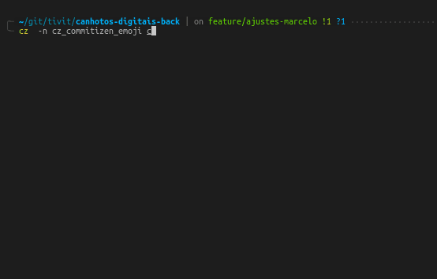

# commitizen-emoji



## What is it

It's a plugin for [commitizen](https://github.com/commitizen-tools/commitizen) that follows specifications from [conventional commmits](https://www.conventionalcommits.org/en/v1.0.0/).

### Features

- Emojis 👽
- Time spent and related tasks
- All from [commitizen](https://github.com/commitizen-tools/commitizen)

### Format

```
<type>(scope): <description> [Time spent][Related tasks]

[optional body]

```

## Installation

`pip install commitizen-emoji`

## Usage

`cz --name cz_commitizen_emoji commit`

or reduced format:

`cz -n cz_commitizen_emoji c`

## Author

Marcelo Maia (mmaia.cc@gmail.com)
